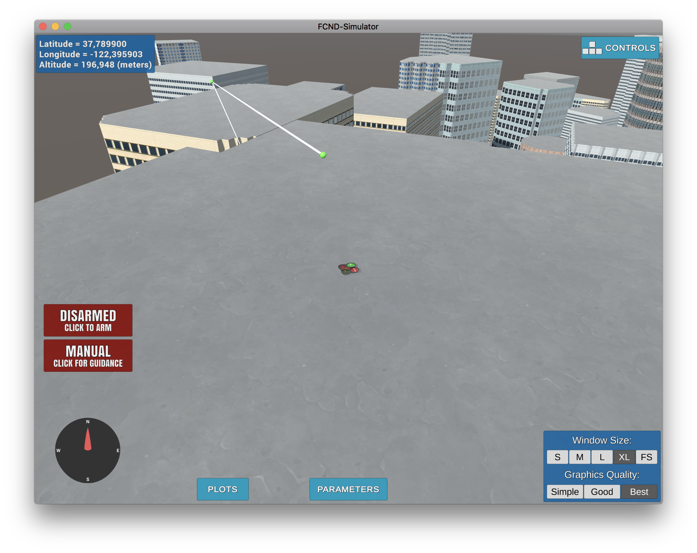

## Project: 3D Motion Planning

---

# Required Steps for a Passing Submission:
1. Load the 2.5D map in the colliders.csv file describing the environment.
2. Discretize the environment into a grid or graph representation.
3. Define the start and goal locations.
4. Perform a search using A* or other search algorithm.
5. Use a collinearity test or ray tracing method (like Bresenham) to remove unnecessary waypoints.
6. Return waypoints in local ECEF coordinates (format for `self.all_waypoints` is [N, E, altitude, heading], where the drone’s start location corresponds to [0, 0, 0, 0].
7. Write it up.
8. Congratulations!  Your Done!

## [Rubric](https://review.udacity.com/#!/rubrics/1534/view) Points
### Here I will consider the rubric points individually and describe how I addressed each point in my implementation.  

---

### Starter Code

`motion_planning.py` and `planning_utils.py` scripts contain a basic planning implementation that includes :
- create_grid function that return a grid centered to [north_offset,east_offset], with True value if obstacle collides at TARGET_ALTITUDE with SAFETY_DISTANCE margin
- a_star function that search for a path to the target point by trying randomly and recursively in each possible direction. It's relatively fast for target point provided in starter code but quite not hard-working for target farther !
- waypoints are sent to the simulator that shows nodes and edges of the path found

And here's a lovely image of my results

### Implementing My Path Planning Algorithm

#### 1. Set global home position

        firstline = list(map(lambda x: x.split(' '), open(filename).readline().replace("\n", "").split(', ')))
        firstline_coord = list(map(lambda x:float(x), [firstline[0][1], firstline[1][1]]))

        #set home as center of map
        self.set_home_position(firstline_coord[1], firstline_coord[0], 0)
I used open() and readline() function to read first line of colliders.csv. After extracting long and lat data, I set self_home_position()) according to these data

#### 2. Set my current local position
            # Determine offsets between grid and map
            north_offset = int(np.abs(np.min(data[:, 0])))
            east_offset = int(np.abs(np.min(data[:, 1])))
            print("North offset = {0}, east offset = {1}".format(north_offset, east_offset))
    
            # set start point as current drone location
            start_ne = (self.local_position[0] + north_offset, self.local_position[1] + east_offset)
    
            # set start height as current drone height + TARGET_ALTITUDE
            start_height = abs(self.local_position[2]) + TARGET_ALTITUDE
            self.target_position[2] = start_height
            print('star_ne : ', start_ne)

#### 3. goal position
goal variable is an argument of plan_path() function. If not equal to [0, 0, 0], then it's the goal  

        if goal != [0, 0, 0]:
            print('goal specified manually')
            north, east, target_height = global_to_local(goal, self.global_home)
            goal_ne = [north + north_offset, east + east_offset]
            target_height = -target_height + TARGET_ALTITUDE
Otherwise, goal is chosen randomly

#### 4. search algorithm
The search algorithm chosen is based on graph. 
The graph is evaluated from a grid that represents the obstacles and with Voronoi method, then optimized with Bresenham algorithm  
###### 4.1 create grid and edges
            grid, edges = create_grid_and_edges(data, TARGET_ALTITUDE, SAFETY_DISTANCE)
The grid is created like the starter code. Edges are created following Voronoi method and optimized with Bresenham algorithm.

###### 4.2 Create graph
            G = create_graph(edges)
I create a graph of edges thanks to create_graph() method in planning_utils.py 

###### 4.3 Define start and goal location and search for a path
            #adjust start point in graph as the closest point in graph from start point
            start_ne_g = closest_point(G, start_ne)
            
            #try to search a path until founded
            while True:
                if goal != [0, 0, 0]:
                    print('goal specified manually')
                    north, east, target_height = global_to_local(goal, self.global_home)
                    goal_ne = [north + north_offset, east + east_offset]
                    target_height = -target_height + TARGET_ALTITUDE
                else:
                    if roof:
                        print("roof authorized")
                        #set goal point as random point from data
                        north = np.random.randint(int(np.abs(np.min(data[:, 0]))) + int(np.abs(np.max(data[:, 0]))))
                        east = np.random.randint(int(np.abs(np.min(data[:, 1]))) + int(np.abs(np.max(data[:, 1]))))
                        target_height = pointHeight(data, [north - north_offset, east - east_offset, 0]) + TARGET_ALTITUDE
                        goal_ne = [north, east]
                    else:
                        print("roof not authorized")
                        #set goal point as random node from graph
                        k = np.random.randint(len(G.nodes))
                        goal_ne = list(G.nodes)[k]
                        target_height = TARGET_ALTITUDE
                print('goal_ne : ',goal_ne)
                print('target_height : ', target_height)
                goal_ne_g = closest_point(G, goal_ne)
    
                print('start_ne_g', start_ne_g)
                print('goal_ne_g', goal_ne_g)
    
                #Serch a path
                t1 = time.time()
                path, cost = a_star(G, heuristic, start_ne_g, goal_ne_g)
                print('a_star took {0} seconds to build'.format(time.time()-t1), 'len(path)', len(path))
                if len(path) > 0:
                    #insert the drone location at first to the path
                    path.insert(0, start_ne)
                    print('path : ', path)
                    break
                else:
                    print("no path found ! Retrying...")
First, start location is set to the closest nodes of graph G created previously  
Then, it tries to found a path until it success
- if goal provided manually, it's the one chosen
- roof as True authorize a target location on a roof.
  - if true, a random location is chosen
  - otherwise, a random nodes in graph is chosen (a node in graph is at TARGET_ALTITUDE height without obstacle at this height)
- the goal location for the path search is set to the closest node in graph
- a_star() is based on graph search 
- if path found, start location of drone is inserted at first to the path

#### 6. Cull waypoints 
        pruned_path = prune_path(path, grid)
I use reduce_bresenham() function to reduce path

#### 6. Extra challenge (roof)
        tmp = pruned_path.pop(0)
        path_final = [tuple([tmp[0], tmp[1], start_height])]
        increment = (target_height - start_height) / (len(pruned_path) - 1)
        goup = 0
        for p in pruned_path:
            path_final.append(tuple((p[0], p[1], start_height + goup)))
            goup += increment
        if roof:
            path_final.append(tuple((goal_ne[0], goal_ne[1], target_height)))
To take in account that drone start or goal location could be on a roof, I adjust the altitude in path by increment (or decrement) progressively the altitude of the path from start to goal location.   
With such a method, the path is not optimized (the drone cannot fly over the buildings) but it works !

Detail of planning_utils.py to take in account roof :  

        def pointHeight(data, point):
        """
        Return the height of a point of 2.5D map (data)
        """
        polygons = extract_polygons(data)
        poly_dic = {}
    
        for p in polygons:
            poly_dic[tuple(p.center)] = p
    
        a = [[p.center] for p in polygons]
        b = [i[0] for i in a]
        tree = KDTree(b)
        idxs = tree.query([point], 10, return_distance=False)[0]
        maxHeight = 0
        for idx in idxs:
            if collides(poly_dic[tuple(b[idx])], point):
                maxHeight = max(maxHeight, poly_dic[tuple(b[idx])].height)
        return maxHeight
pointHeight() function calculate the height of a point. To do this, polygons that represent obstacle are created (without margin).  
if one of the polygons collide with the point, its height is returned.  
I use the KDTree method and dictionary of polygons to optimize performance.

### Execute the flight
#### 1. Does it work?
It works!

Sometimes it doesn't :
- because of aproximation of the breseham method, some lines between nodes crosses the end of the corner of a building
- because of drone inertia when angle between 2 lines are two important and the node close to a building, the drone deviate from the target line and hurts a building   

I tried to implement receding horizon to prevent these issues :

        def receding_horizon(data, loc, target):
            """
            Incomplete function - TODO
            """
            voxmap = create_voxmap(data, loc)
            line = LineString((0,0),(target[0] - loc[0], target[1] - loc[1]))
            polygon = box(-20, -20, 20, 20)
            if line.within(polygon):
                target_voxmap = (target[0] - loc[0], target[1] - loc[1], target[2])
            else:
                target_voxmap = (polygon.intersection(line).bounds[2], polygon.intersection(line).bounds[3])

but I didn't have enough time to go beyond creating the voxmap with obstacle around drone location

Thank you for your attention !